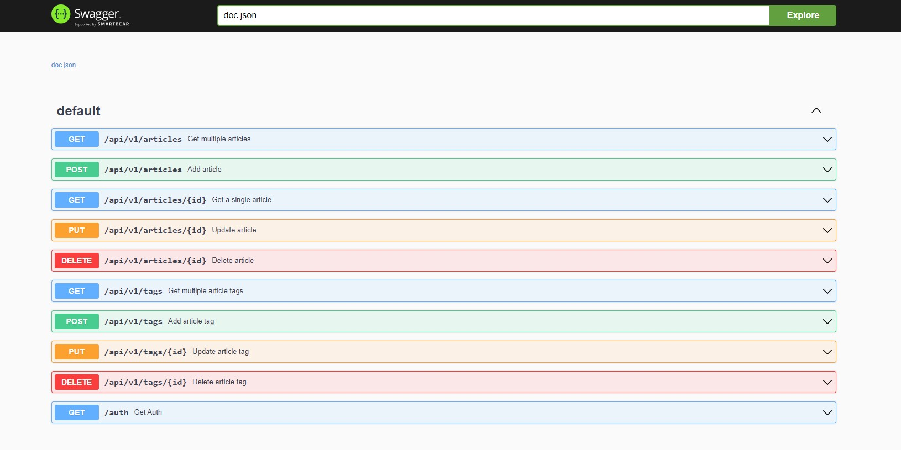
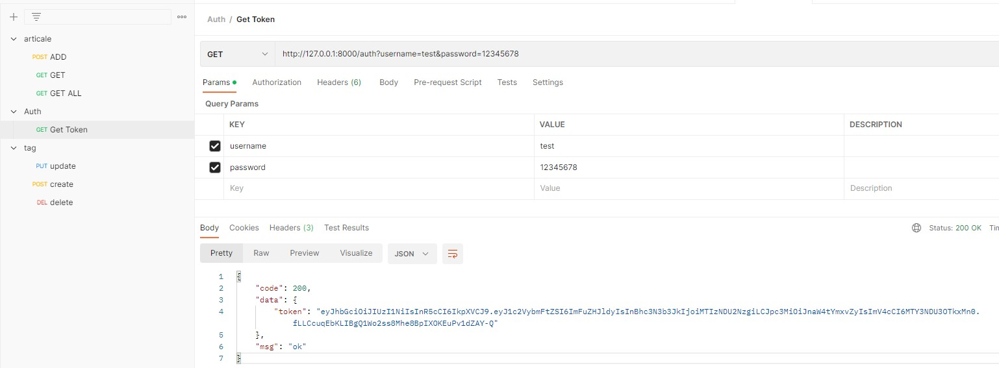
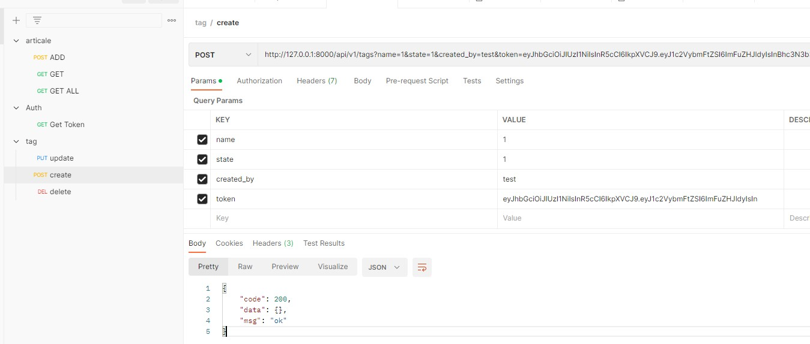
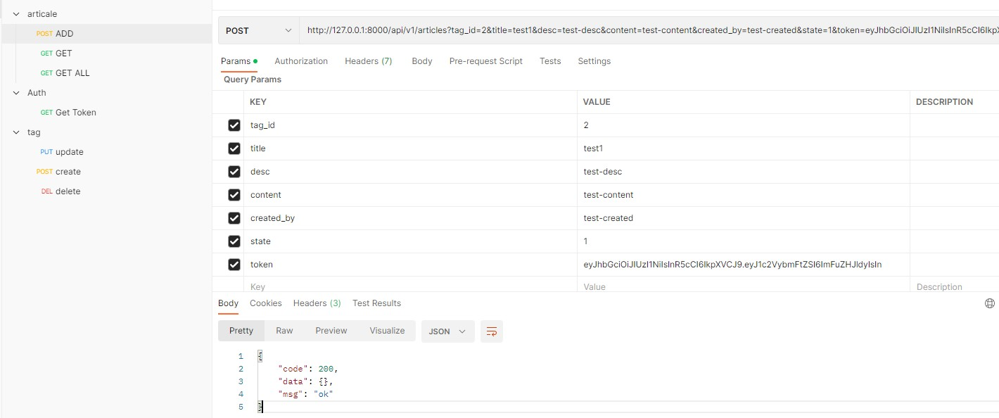
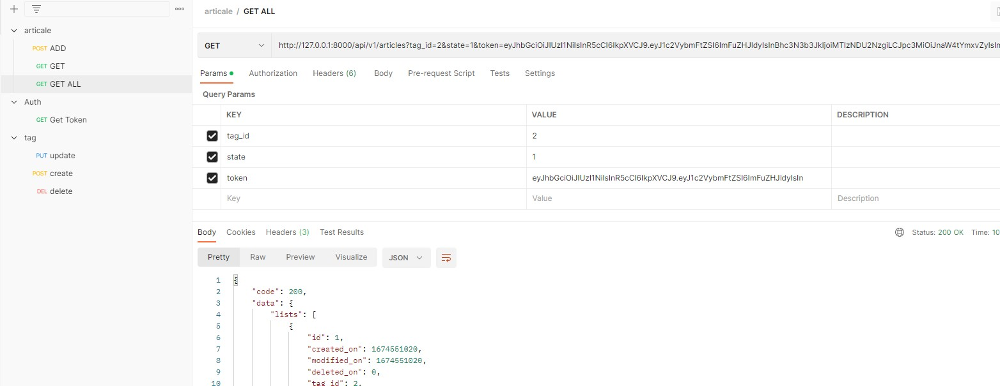

Blog文章後台管理服務
===
以Gin框架為基礎整合jwt Middleware、Mysql、Gorm實作。

實作目的:
---
1. 以Blog文章後台管理應用示範Gin框架整合Gorm與Mysql資料庫套裝服務。
2. (Authentication) 結合jwt Middleware作Restful API的Token認證 
3. 使用ORM方式存取資料庫
4. 整合Swagger套件自動生成API手冊

<br>


詳細資訊
===
軟體版本:
* go v1.18.10
* mysql Community 8.0.32
* golang-jwt/jwt/v4 v4.4.3


環境所需軟體:
* MySQL 

專案結構:
```
go-blogdemo/
├── .env
├── main.go
├── middleware
│   └── jwt.go
├── models
│   ├── article.go
│   ├── auth.go
│   ├── models.go
│   └── tag.go
├── pkg
│   ├── errorcode
│   │   └── error_code.go
│   ├── setting
│   │   └── setting.go
│   └── tools
│       ├── jwt.go
│       └── tool.go
├── routers
│   ├── api
│   │   ├── tag.go
│   │   ├── auth.go
│   │   └── article.go
│   └── router.go
├── docs/
│   ├── docs.go
│   ├── swagger.json
│   └── swagger.yaml
├── img/ (圖片)
└── collection/ (Postman範例腳本)

```


相關系統參數請至.env修改:
```
RUN_MODE = debug
PAGE_SIZE = 10
JWT_SECRET = tgbrfvedc
HTTP_PORT = 8000
READ_TIMEOUT = 60
WRITE_TIMEOUT = 60
TYPE = mysql
USER = root
PASSWORD = rootroot
HOST = 127.0.0.1
NAME = blog
TABLE_PREFIX = blog_
```

<br>

資料表:
===
需事先建立"blog"資料庫與以下資料表:
``` sql
CREATE TABLE `blog_tag` (
  `id` int(10) unsigned NOT NULL AUTO_INCREMENT,
  `name` varchar(100) DEFAULT '',
  `created_on` int(10) unsigned DEFAULT '0',
  `created_by` varchar(100) DEFAULT '' ,
  `modified_on` int(10) unsigned DEFAULT '0',
  `modified_by` varchar(100) DEFAULT '',
  `deleted_on` int(10) unsigned DEFAULT '0',
  `state` tinyint(3) unsigned DEFAULT '1' ,
  PRIMARY KEY (`id`)
) ENGINE=InnoDB DEFAULT CHARSET=utf8;


CREATE TABLE `blog_article` (
  `id` int(10) unsigned NOT NULL AUTO_INCREMENT,
  `tag_id` int(10) unsigned DEFAULT '0' ,
  `title` varchar(100) DEFAULT '' ,
  `desc` varchar(255) DEFAULT '' ,
  `content` text,
  `created_on` int(11) DEFAULT NULL,
  `created_by` varchar(100) DEFAULT '' ,
  `modified_on` int(10) unsigned DEFAULT '0' ,
  `modified_by` varchar(255) DEFAULT '' ,
  `deleted_on` int(10) unsigned DEFAULT '0',
  `state` tinyint(3) unsigned DEFAULT '1' ,
  PRIMARY KEY (`id`)
) ENGINE=InnoDB DEFAULT CHARSET=utf8;

CREATE TABLE `blog_auth` (
  `id` int(10) unsigned NOT NULL AUTO_INCREMENT,
  `username` varchar(50) DEFAULT '' ,
  `password` varchar(50) DEFAULT '' ,
  PRIMARY KEY (`id`)
) ENGINE=InnoDB DEFAULT CHARSET=utf8;

INSERT INTO `blog`.`blog_auth` (`id`, `username`, `password`) VALUES (null, 'user', '12345678');
```


安裝&運行:
===
```
1. 需先安裝go編譯環境
2. swag init -g main.go ...(所有你要加入swag的.go檔)
3. cp docs/docs.go docs.go
4. sed -i 's/package docs/package main/g' docs.go
5. go build -v 生成執行檔
```

運行狀態:
```
[GIN-debug] [WARNING] Running in "debug" mode. Switch to "release" mode in production.
 - using env:   export GIN_MODE=release
 - using code:  gin.SetMode(gin.ReleaseMode)

[GIN-debug] GET    /swagger/*any             --> github.com/swaggo/gin-swagger.CustomWrapHandler.func1 (3 handlers)
[GIN-debug] GET    /test                     --> go-gin-demo/routers.InitRouter.func1 (3 handlers)
[GIN-debug] GET    /auth                     --> go-gin-demo/routers/api.GetAuth (3 handlers)
[GIN-debug] GET    /api/v1/tags              --> go-gin-demo/routers/api.GetTags (4 handlers)
[GIN-debug] POST   /api/v1/tags              --> go-gin-demo/routers/api.AddTag (4 handlers)
[GIN-debug] PUT    /api/v1/tags/:id          --> go-gin-demo/routers/api.EditTag (4 handlers)
[GIN-debug] DELETE /api/v1/tags/:id          --> go-gin-demo/routers/api.DeleteTag (4 handlers)
[GIN-debug] GET    /api/v1/articles          --> go-gin-demo/routers/api.GetArticles (4 handlers)
[GIN-debug] GET    /api/v1/articles/:id      --> go-gin-demo/routers/api.GetArticle (4 handlers)
[GIN-debug] POST   /api/v1/articles          --> go-gin-demo/routers/api.AddArticle (4 handlers)
[GIN-debug] PUT    /api/v1/articles/:id      --> go-gin-demo/routers/api.EditArticle (4 handlers)
[GIN-debug] DELETE /api/v1/articles/:id      --> go-gin-demo/routers/api.DeleteArticle (4 handlers)
2023/01/24 23:17:39 [info] start http server listening :8000
```


程式啟動後，瀏覽器輸入http://127.0.0.1:8000/swagger/index.html可以開啟Swagger手冊。   



<br>


Demo Example:
===
1. 使用正確的帳密取得Token

2. 建立文章分類引用的Tag，需帶入Token

3. 建立文章

4. 查詢文章


* * *
其他請參閱 Swagger DOCS。
